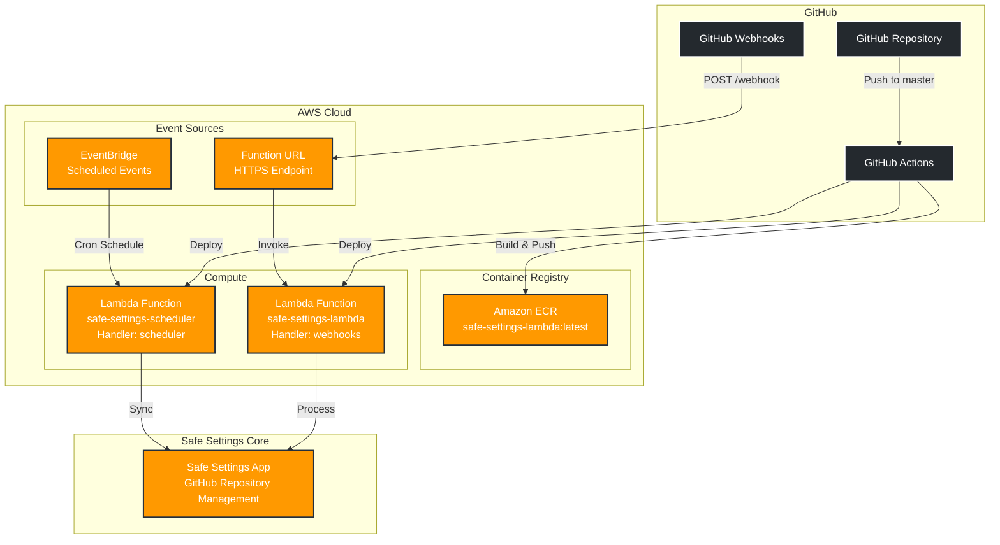
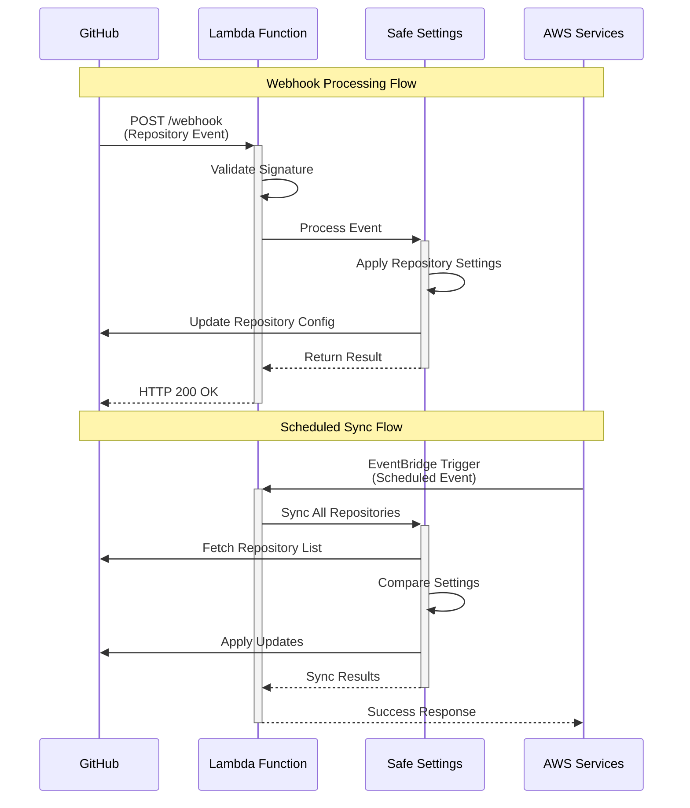
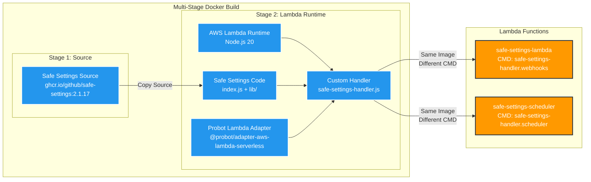
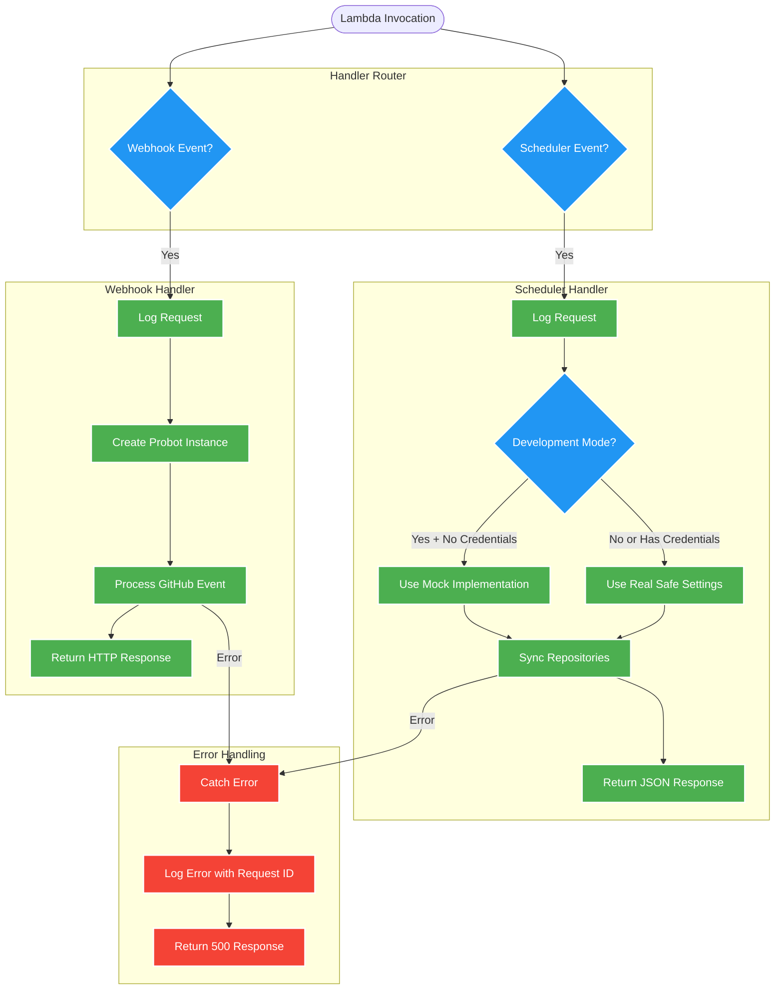

# Safe Settings AWS Lambda Template

A production-ready template for deploying [GitHub Safe Settings](https://github.com/github/safe-settings) to AWS Lambda using Docker containers with automated GitHub Actions deployment.

## 🎯 Template Usage

> **This is a GitHub template repository**
> 
> 1. Click the **"Use this template"** button above
> 2. Create a new repository in your organization
> 3. Follow the [Template Setup Guide](TEMPLATE_SETUP.md) for complete configuration
> 4. Deploy your own Safe Settings instance to AWS Lambda

**Quick Links:**
- 📋 [Complete Setup Guide](TEMPLATE_SETUP.md)
- 🚀 [Quick Start](#quick-start)
- 🏗️ [Architecture](#architecture)
- 🧪 [Local Development](#local-development)

## Overview

This template provides a complete AWS Lambda deployment of Safe Settings with:

- **🏗️ Modular Architecture** - Clean separation of concerns with utility modules
- **🧪 Comprehensive Testing** - Unit tests with coverage reporting
- **🚀 Automated CI/CD** - GitHub Actions for testing, building, and deployment
- **📊 Smart Routing** - Handles both GitHub webhooks and scheduled sync operations
- **🐳 Containerized** - Uses official Safe Settings source with Lambda adapter
- **⚡ Serverless** - Pay only for execution time, auto-scaling included

## Architecture

### 🏗️ **High-Level Architecture**



### 🔄 **Request Flow Diagram**



### 🐳 **Container Architecture**



### 🔧 **Handler Logic Flow**



### 🚀 **CI/CD Pipeline**



```mermaid
graph LR
    subgraph "GitHub Actions"
        subgraph "Test Stage"
            UT[Unit Tests<br/>Jest]
            LT[Lambda Tests<br/>Local Simulation]
            DT[Development Tests<br/>Mock Validation]
            ST[Security Audit<br/>npm audit]
        end
        
        subgraph "Build Stage"
            DB[Docker Build<br/>Multi-stage]
            PUSH[Push to ECR<br/>SHA + latest tags]
        end
        
        subgraph "Deploy Stage"
            UF1[Update Lambda<br/>safe-settings-lambda]
            UF2[Update Lambda<br/>safe-settings-scheduler]
            ENV[Set Environment<br/>Variables]
        end
    end
    
    subgraph "Triggers"
        PR[Pull Request]
        PUSH_MASTER[Push to Master]
    end
    
    PR --> UT
    PUSH_MASTER --> UT
    
    UT --> LT
    LT --> DT
    DT --> ST
    ST --> DB
    
    DB --> PUSH
    PUSH --> UF1
    UF1 --> UF2
    UF2 --> ENV
    
    classDef test fill:#4CAF50,stroke:#fff,stroke-width:2px,color:#fff
    classDef build fill:#2196F3,stroke:#fff,stroke-width:2px,color:#fff
    classDef deploy fill:#FF9900,stroke:#232F3E,stroke-width:2px,color:#fff
    classDef trigger fill:#9C27B0,stroke:#fff,stroke-width:2px,color:#fff
    
    class UT,LT,DT,ST test
    class DB,PUSH build
    class UF1,UF2,ENV deploy
    class PR,PUSH_MASTER trigger
```

## Features

### 🔧 **Official Handler Pattern**
- **Webhook Handler**: Dedicated Lambda function (`safe-settings-lambda`) for GitHub webhook events
- **Scheduler Handler**: Separate Lambda function (`safe-settings-scheduler`) for scheduled sync operations
- **Shared Container**: Both functions use the same Docker image with different entry points
- **Docker Integration**: Uses official Safe Settings source with Lambda adapter layer
- **Development Support**: Includes mock app function for local testing without dependencies
- **Minimal Footprint**: Clean, dependency-free handler that leverages official Safe Settings validation

### 🧪 **Testing & Quality**
- **Unit Tests**: Comprehensive test suite with Jest
- **Coverage Reporting**: Automatic coverage reports on pull requests
- **Integration Tests**: Validates module loading and file structure
- **CI/CD Pipeline**: Automated testing on every PR and push

### 📦 **Deployment**
- **Docker Build**: Multi-stage build for optimal Lambda performance
- **Security Scanning**: Automated security audits and secret detection
- **Node.js 20**: Latest LTS runtime support

## Quick Start

### 1. Prerequisites

- AWS Account with ECR and Lambda access
- GitHub repository with Actions enabled
- **Node.js 20+ (Latest LTS recommended)** for local development
- npm 10+ (comes with Node.js 20+)

### 2. AWS Setup

Create required AWS resources:

```bash
# Create ECR repository
aws ecr create-repository --repository-name safe-settings-lambda --region YOUR_AWS_REGION

# Create IAM role for GitHub Actions (replace YOUR_ACCOUNT, YOUR_ORG, YOUR_REPO, and YOUR_AWS_REGION)
aws iam create-role --role-name safe-settings-github-deploy-role --assume-role-policy-document '{
  "Version": "2012-10-17",
  "Statement": [
    {
      "Effect": "Allow",
      "Principal": {"Federated": "arn:aws:iam::YOUR_ACCOUNT:oidc-provider/token.actions.githubusercontent.com"},
      "Action": "sts:AssumeRole",
      "Condition": {
        "StringEquals": {
          "token.actions.githubusercontent.com:sub": "repo:YOUR_ORG/YOUR_REPO:ref:refs/heads/master"
        }
      }
    }
  ]
}'

# Create main Lambda function for webhooks
aws lambda create-function \
  --function-name safe-settings-lambda \
  --code ImageUri=YOUR_ACCOUNT.dkr.ecr.us-east-2.amazonaws.com/safe-settings-lambda:latest \
  --role arn:aws:iam::YOUR_ACCOUNT:role/lambda-execution-role \
  --package-type Image \
  --timeout 30 \
  --memory-size 512 \
  --image-config '{"Command":["safe-settings-handler.webhooks"]}'

# Create scheduler Lambda function (same image, different handler)
aws lambda create-function \
  --function-name safe-settings-scheduler \
  --code ImageUri=YOUR_ACCOUNT.dkr.ecr.us-east-2.amazonaws.com/safe-settings-lambda:latest \
  --role arn:aws:iam::YOUR_ACCOUNT:role/lambda-execution-role \
  --package-type Image \
  --timeout 60 \
  --memory-size 512 \
  --image-config '{"Command":["safe-settings-handler.scheduler"]}'

# Note: For existing functions, update code and configuration separately:
# aws lambda update-function-code --function-name FUNCTION_NAME --image-uri IMAGE_URI
# aws lambda update-function-configuration --function-name FUNCTION_NAME --image-config '{"Command":["HANDLER"]}'

# Create Function URL for GitHub webhooks
aws lambda create-function-url-config \
  --function-name safe-settings-lambda \
  --auth-type NONE \
  --cors '{"AllowOrigins":["*"],"AllowMethods":["POST"]}'
```

### 3. GitHub Configuration

#### Repository Variables
Configure these variables in your GitHub repository settings:

```
AWS_REGION=your-aws-region
AWS_ACCOUNT_ID=your-aws-account-id
ECR_REPOSITORY=safe-settings-lambda
LAMBDA_FUNCTION_NAME=safe-settings-lambda
SCHEDULER_FUNCTION_NAME=safe-settings-scheduler
GH_ORG=your-organization
APP_ID=your-github-app-id
WEBHOOK_SECRET=your-webhook-secret
SAFE_SETTINGS_GITHUB_CLIENT_ID=your-client-id
```

#### Repository Secrets
Configure these secrets in your GitHub repository settings:

```
PRIVATE_KEY=your-github-app-private-key
SAFE_SETTINGS_GITHUB_CLIENT_SECRET=your-client-secret
```

### 4. Deploy

Push to the `master` or `main` branch to trigger automatic deployment:

```bash
git push origin master
```

The GitHub Actions workflow will:
1. Run tests and generate coverage reports
2. Build the Docker image
3. Push to ECR
4. Update the Lambda function
5. Configure environment variables

## Local Development

### Setup

```bash
# Install dependencies
npm install

# Run tests
npm test

# Run tests with coverage
npm run test:coverage

# Run tests in watch mode
npm run test:watch
```

### Project Structure

```
├── safe-settings-handler.js     # Main Lambda handler with smart routing
├── utils/
│   └── keyUtils.js              # Private key validation & normalization
├── tests/
│   ├── keyUtils.test.js         # Unit tests for key utilities
│   └── simple-integration.test.js # Integration tests
├── .github/workflows/
│   ├── test.yml                 # CI/CD pipeline for testing & building
│   └── deploy_to_lambda.yml     # Production deployment workflow
├── Dockerfile                   # Multi-stage Lambda container build
└── package.json                 # Dependencies & test configuration
```

### Handler Logic

The main handler intelligently routes events:

```javascript
// EventBridge scheduled events → Poller
if (event.source === 'aws.events' || event.sync === true) {
  return await pollerHandler(event, context)
}

// GitHub webhooks → Webhook handler  
return await webhookHandler(event, context)
```

### Testing

Run different test suites:

```bash
# All tests
npm test

# With coverage
npm run test:coverage

# Watch mode for development
npm run test:watch

# Specific test file
npx jest tests/keyUtils.test.js
```

## Scheduling Sync Operations

> **💡 Infrastructure as Code Recommendation**
> 
> While the commands below show how to set up EventBridge scheduling manually, it's **strongly recommended** to manage EventBridge schedules through infrastructure as code tools like **Terraform**, **AWS CDK**, or **CloudFormation**. This ensures:
> - Version-controlled infrastructure changes
> - Consistent deployments across environments
> - Easier rollbacks and environment management
> - Better integration with your existing infrastructure pipeline

### Manual Setup (for testing/development)

Set up EventBridge to trigger periodic syncs:

```bash
# Create EventBridge rule for 5-minute sync
aws events put-rule \
  --name safe-settings-sync-schedule \
  --schedule-expression "rate(5 minutes)"

# Add Lambda target (scheduler function) - replace YOUR_AWS_REGION and YOUR_ACCOUNT
aws events put-targets \
  --rule safe-settings-sync-schedule \
  --targets "Id"="1","Arn"="arn:aws:lambda:YOUR_AWS_REGION:YOUR_ACCOUNT:function:safe-settings-scheduler"

# Grant EventBridge permission to invoke Lambda
aws lambda add-permission \
  --function-name safe-settings-scheduler \
  --statement-id allow-eventbridge \
  --action lambda:InvokeFunction \
  --principal events.amazonaws.com \
  --source-arn arn:aws:events:YOUR_AWS_REGION:YOUR_ACCOUNT:rule/safe-settings-sync-schedule
```

### Terraform Example

```hcl
# Example Terraform configuration for EventBridge scheduling
resource "aws_cloudwatch_event_rule" "safe_settings_sync" {
  name                = "safe-settings-sync-schedule"
  description         = "Trigger Safe Settings sync every 5 minutes"
  schedule_expression = "rate(5 minutes)"
}

resource "aws_cloudwatch_event_target" "lambda_target" {
  rule      = aws_cloudwatch_event_rule.safe_settings_sync.name
  target_id = "SafeSettingsSchedulerTarget"
  arn       = aws_lambda_function.safe_settings_scheduler.arn
}

resource "aws_lambda_permission" "allow_eventbridge" {
  statement_id  = "AllowExecutionFromEventBridge"
  action        = "lambda:InvokeFunction"
  function_name = aws_lambda_function.safe_settings_scheduler.function_name
  principal     = "events.amazonaws.com"
  source_arn    = aws_cloudwatch_event_rule.safe_settings_sync.arn
}
```

## Manual Sync

Trigger a manual sync operation:

```bash
# Invoke with sync flag
aws lambda invoke \
  --function-name safe-settings-lambda \
  --payload '{"sync": true}' \
  response.json
```

## Monitoring

### CloudWatch Logs

Monitor Lambda execution:

```bash
# View recent logs (replace with your function name)
aws logs tail /aws/lambda/YOUR_LAMBDA_FUNCTION_NAME --follow

# Filter for errors
aws logs filter-log-events \
  --log-group-name /aws/lambda/YOUR_LAMBDA_FUNCTION_NAME \
  --filter-pattern "ERROR"
```

### GitHub Actions

Monitor deployments and test results in the Actions tab of your repository. Each PR will automatically:

- Run tests on Node.js 20
- Generate coverage reports
- Comment with test results
- Validate Docker builds
- Run security audits

## Troubleshooting

### Common Issues

1. **Module not found errors**: Ensure `utils/` directory is included in Dockerfile
2. **Environment variables**: Verify all required secrets are set in GitHub
3. **Permissions**: Check IAM roles have ECR and Lambda access
4. **Webhook URL**: Use the Lambda Function URL as your GitHub App webhook URL

### Debug Mode

Enable debug logging by setting `LOG_LEVEL=debug` in the Lambda environment variables.

## Template Maintenance

### Contributing to the Template

1. Fork this template repository
2. Create a feature branch for template improvements
3. Add tests for new functionality
4. Ensure all tests pass: `npm test`
5. Submit a pull request to improve the template

### Using the Template

1. Click "Use this template" to create your own repository
2. Follow the [Template Setup Guide](TEMPLATE_SETUP.md)
3. Customize for your organization's needs
4. Deploy to your AWS environment

## Template Features

✅ **Production Ready**: Battle-tested deployment pattern  
✅ **Fully Generic**: No organization-specific code  
✅ **Comprehensive Documentation**: Step-by-step setup guide  
✅ **CI/CD Included**: GitHub Actions workflows  
✅ **Local Development**: Mock implementation for testing  
✅ **Multi-Environment**: Template supports staging/production  
✅ **Security Focused**: IAM roles, secrets management  
✅ **Monitoring Ready**: CloudWatch integration  

## License

This template adapts the official Safe Settings application for AWS Lambda deployment. See the [Safe Settings repository](https://github.com/github/safe-settings) for the original license.

---

**Template Repository**: This is a template for deploying Safe Settings. Click "Use this template" to get started with your own deployment.
